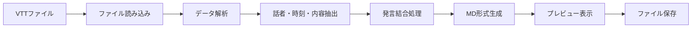

# VTT2MD 開発プロジェクトマニュアル

## 1. プロジェクト概要

### 1.1. 目的とユースケース
Microsoft Teams会議のトランスクリプト（VTTファイル）を、CopilotなどのAIで処理しやすい整形されたMarkdown形式に自動変換するデスクトップアプリケーションを開発する。これにより、議事録作成の効率化を目指す。

### 1.2. 用語集
- **VTT (WebVTT):** Web Video Text Tracks format。動画や音声の字幕やキャプションを格納するためのフォーマット。
- **Markdown (MD):** プレーンテキストからHTMLを生成するために設計された軽量マークアップ言語。
- **Copilot:** Microsoftが提供するAIアシスタント。
- **GUI:** グラフィカルユーザインタフェース。

### 1.3. ロードマップ & リリースポリシー
- **v1.0 (2025/09/01):** 基本的なVTTからMDへの変換機能を持つ初期バージョン。
- **v1.1 (2025/10/01):** 軽微なバグ修正とパフォーマンス改善。
- **v2.0 (TBD):** 複数ファイルの一括処理、他フォーマット対応などのメジャーアップデート。
- リリースはセマンティックバージョニング（SemVer）に従う。

## 2. アーキテクチャと設計原則

### 2.1. プロジェクト構造
本プロジェクトは、保守性と拡張性を高めるため、`src`レイアウトを採用しています。

```
VTT2MD/
├── .gitignore          # Gitの追跡対象外ファイルを指定
├── GEMINI.md           # この開発マニュアル
├── main.spec           # PyInstallerのビルド設定ファイル
├── requirements.txt    # アプリケーションの依存ライブラリ
├── requirements-dev.txt # 開発用の依存ライブラリ (pytestなど)
│
├── src/
│   └── vtt2md/
│       ├── __init__.py
│       ├── main.py     # GUIアプリケーションのエントリポイント
│       └── converter.py  # VTTからMDへの変換ロジック
│
├── docs/               # ドキュメント関連
│
├── samples/
│   ├── input/          # 入力VTTサンプル
│   └── output/         # 出力MDサンプル
│
└── tests/
    └── test_converter.py # converter.pyの単体テスト
```

### 2.2. システム構成
- **言語:** Python
- **GUI:** Tkinter (+ ttk)
- **主要ライブラリ:**
    - `webvtt-py`: VTTファイルの解析
    - `datetime`: 時刻処理
    - `pathlib`: ファイルパス操作

### 2.2. データフロー


### 2.3. 拡張機構
- **プラグイン:** 将来的に、入力フィルタ（例: SRT対応）や出力レンダラ（例: DOCX出力）を追加できるような構造を検討する。
- **設定ファイル:** UIテーマや変換オプションを外部ファイル（例: `config.json`）で管理できるようにする。

## 3. 開発環境 & ビルド手順

### 3.1. サポート環境
- **OS:** Windows 11
- **Python:** 3.9 以上
- **文字コード:** UTF-8

### 3.2. セットアップ
1. Python 3.9以上をインストールします。
2. プロジェクトのルートディレクトリで、必要なライブラリをインストールします:
   ```bash
   # アプリケーション実行に必要なライブラリ
   pip install -r requirements.txt

   # 開発・テストに必要なライブラリ
   pip install -r requirements-dev.txt
   ```
3. スクリプトを実行します:
   ```bash
   python src/vtt2md/main.py
   ```

### 3.3. 実行ファイル(.exe)のビルド
1. **ビルドツールのインストール**
   `requirements.txt` に含まれる `pyinstaller` をインストールします。

2. **ビルド実行**
   プロジェクトのルートディレクトリで、`main.spec` ファイルを使用してビルドします。
   ```bash
   pyinstaller main.spec
   ```
   ビルドが成功すると、`dist`フォルダ内に`VTT2MD.exe`が生成されます。

   **デバッグ時の注意:**
   `.exe`が正常に動作しない場合は、`main.spec`内の`console=False`を`console=True`に変更してビルドし、コマンドプロンプトから実行してエラーメッセージを確認してください。

## 4. コーディング規約 & ベストプラクティス

### 4.1. フォーマット
- [Black](https://github.com/psf/black) を使用してコードフォーマットを統一する。

### 4.2. 命名規則
- 変数・関数: スネークケース (`variable_name`)
- クラス: パスカルケース (`ClassName`)

### 4.3. エラーハンドリング
- ファイルI/Oや変換処理では `try-except` ブロックを使用し、ユーザーに分かりやすいエラーメッセージをGUI上に表示する。

### 4.4. 実装ガイドライン（軽量化・安定化）
- **依存関係の最小化:**
  - 外部ライブラリの追加は慎重に検討し、可能な限りPythonの標準ライブラリ（`tkinter`, `datetime`, `pathlib`等）を使用する。
  - これにより、`.exe`ファイルのサイズを小さく保ち、実行環境による問題を低減する。
- **UIとロジックの分離:**
  - GUIを制御するコード（`main.py`など）と、VTTを解析・変換するコアロジック（例: `converter.py`）を別のファイルに分離する。
  - これにより、コードの見通しが良くなり、テストや改修が容易になる。
- **応答性の高いUI:**
  - ファイルの読み込みや変換などの時間のかかる処理は、`threading`モジュールを使用してバックグラウンドスレッドで実行する。
  - これにより、処理中にUIがフリーズするのを防ぎ、ユーザー体験を向上させる。
- **堅牢なエラーハンドリング:**
  - `FileNotFoundError`, `UnicodeDecodeError`, VTT解析時のエラーなど、想定される例外を個別に捕捉し、それぞれに適したエラーメッセージを表示する。
- **リソース管理:**
  - `with open(...)` 構文を使用してファイルを扱い、処理が完了または失敗した際にファイルが自動的にクローズされるようにする。

## 5. テスト戦略

- **単体テスト:** 各変換ロジック（話者抽出、発言結合など）を個別にテストする。
- **結合テスト:** 実際のVTTファイルを入力し、期待されるMarkdownが出力されるかを確認する。

## 6. API & CLI リファレンス (将来構想)
- 現状はGUIアプリケーションのみだが、将来的にCLIを提供する場合、`argparse` を利用し、以下の様なインターフェースを想定する。
  ```bash
  vtt2md <input_file.vtt> -o <output_file.md>
  ```

## 7. メンテナンス & リリース管理

### 7.1. ブランチモデル
- **main:** 安定版（リリース用）
- **develop:** 開発中の最新版
- **feature/xxx:** 機能追加・修正用ブランチ

### 7.2. CHANGELOG
- リリースの際には、変更点を `CHANGELOG.md` に記録する。

## 8. トラブルシューティング & FAQ

- **Q: VTTファイル以外のファイルは読み込めますか？**
  - A: いいえ。現在はVTTファイルのみ対応しています。
- **Q: 変換に失敗します。**
  - A: VTTファイルのフォーマットが不正であるか、ファイルが破損している可能性があります。ファイルの内容を確認してください。

## 9. 参考資料
- [WebVTT Specification](https://www.w3.org/TR/webvtt1/)
- [要件定義書](docs/requirements.md)
