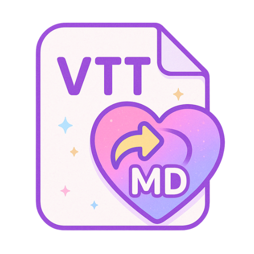

# VTT2MD

Microsoft Teamsの会議トランスクリプト（.vttファイル）を、AI（Copilotなど）が解析しやすい整形されたMarkdownファイルに変換するためのデスクトップアプリケーションです。

## 主な機能

-   **VTTからMarkdownへ変換**: TeamsのVTTファイルから話者と発言を抽出し、Markdown形式に整形します。
-   **直感的なUI**: モダンなデザインのGUIで、誰でも簡単に操作できます。
-   **ドラッグ＆ドロップ**: ファイルをウィンドウにドラッグ＆ドロップするだけで変換を開始できます。
-   **ファイル選択**: もちろん、ファイル選択ダイアログからの指定も可能です。
-   **リアルタイムプレビュー**: 変換後のMarkdownをアプリ内で確認できます。
-   **ファイル保存**: 変換後のMarkdownを`.md`ファイルとして保存できます。

## ご利用ガイド（ユーザー向け）

### 動作環境
- Windows 11

### 使い方

1.  `VTT2MD_vX.X.zip`（バージョン名は異なる場合があります）をダウンロードします。
2.  ダウンロードしたZIPファイルを右クリックし、「すべて展開」や「解凍」を選択して、中身をフォルダに取り出します。
3.  解凍してできた`VTT2MD`という名前のフォルダを開きます。
4.  フォルダの中にある`VTT2MD.exe`をダブルクリックして、アプリケーションを起動します。

*アプリケーションが起動したら、ウィンドウ内にVTTファイルをドラッグ＆ドロップするか、「ファイルを選択」ボタンからファイルを選んで変換を開始してください。*

### 注意事項

#### Windowsからの警告について

初めて起動する際に、「WindowsによってPCが保護されました」という青い画面が表示されることがあります。これは、アプリに開発者の署名がないために表示されるものです。

その場合は、以下の手順で起動してください。

1.  メッセージの下にある「**詳細情報**」をクリックします。
2.  右下に表示される「**実行**」ボタンをクリックします。

#### ファイルの移動について

`VTT2MD.exe`は、単体では動作しません。**`VTT2MD.exe`だけを別の場所に移動させないでください。** アプリケーションを移動させたい場合は、フォルダごと移動してください。

## 開発者向け情報

### セットアップ

1.  **Pythonのインストール**:
    -   Python 3.9 以上をインストールしてください。
2.  **リポジトリのクローン**:
    ```bash
    git clone <your-repository-url>
    cd VTT2MD
    ```
3.  **依存関係のインストール**:
    ```bash
    # アプリケーション実行に必要なライブラリ
    pip install -r requirements.txt

    # 開発・テストに必要なライブラリ
    pip install -r requirements-dev.txt
    ```

### 実行

開発モードでアプリケーションを実行する場合：

```bash
python src/vtt2md/main.py
```

### ビルド

配布用の単一実行ファイル（`.exe`）を作成する場合：

```bash
python -m pyinstaller src/vtt2md/main.py --onefile --windowed --name VTT2MD
```

ビルドが成功すると、`dist`フォルダ内に`VTT2MD.exe`が生成されます。
