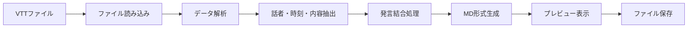

# VTT to MD 変換ツール 要件定義書

## 1. 概要

### 1.1 目的
Microsoft Teams会議のトランスクリプト（VTTファイル）を、Copilotで処理しやすい整形されたMarkdown形式に自動変換するデスクトップアプリケーションを開発する。

### 1.2 背景
- Copilotは直接VTTファイルを読み込めない
- 手動での整形作業は時間がかかる
- 議事録作成の効率化が必要

### 1.3 スコープ
- **含む**: VTTファイルの読み込み、話者情報の抽出、発言の結合、MD形式での出力
- **含まない**: 発言内容の修正（誤字脱字、フィラー除去、表記ゆれ訂正）

## 2. 機能要件

### 2.1 ファイル入力機能
- ドラッグ&ドロップによるVTTファイル入力
- ファイル選択ダイアログによる入力（代替手段）
- VTTファイル以外の拒否とエラー表示

### 2.2 データ解析機能
- VTTファイルからの話者名抽出
- 発言時刻と内容の抽出
- ファイル作成日時の取得
- 会議名のファイル名からの抽出（拡張子を除く）

### 2.3 データ変換機能
- 同一話者の1分以内の連続発言を結合
- 時刻フォーマットの変換（HH:MM:SS → [HH:MM:SS]形式）
- 話者一覧の自動生成
- 所要時間の自動計算

### 2.4 出力機能
- Markdown形式でのテキスト生成
- 変換結果のプレビュー表示
- ファイルダウンロード機能

### 2.5 エラーハンドリング
- 不正なファイル形式の検知と通知
- 変換エラーの適切な表示
- ユーザーへの分かりやすいエラーメッセージ

## 3. 非機能要件

### 3.1 ユーザビリティ
- 直感的で分かりやすいUI
- MS LoopやClaude Desktopに近い操作感
- 白基調のモダンでスタイリッシュなデザイン

### 3.2 パフォーマンス
- 1時間程度の会議録（約10MB）を5秒以内に変換

### 3.3 互換性
- Windows 11での動作
- UTF-8エンコーディング対応

## 4. 画面設計

### 4.1 初期画面
```
┌──────────────────────────────────────────┐
│              VTT → MD Converter          │
├──────────────────────────────────────────┤
│                                          │
│         ╭─────────────────╮              │
│         │                 │              │
│         │  📁             │              │
│         │                 │              │
│         │  ファイルを     │              │
│         │  ドロップ       │              │
│         │                 │              │
│         ╰─────────────────╯              │
│                                          │
│       [ ファイルを選択 ]                 │
│                                          │
├──────────────────────────────────────────┤
│ ステータス: 待機中                       │
└──────────────────────────────────────────┘
```

### 4.2 変換完了画面
```
┌──────────────────────────────────────────┐
│              VTT → MD Converter          │
├──────────────────────────────────────────┤
│  ✓ 変換完了                              │
│                                          │
│  ┌────────────────────────────────┐     │
│  │ # 【IPONC】資料作成打合せ 文字... │     │
│  │                                │     │
│  │ **日時:** 2025年8月4日         │     │
│  │ **参加者:**                    │     │
│  │ - 遠藤 真輝                    │     │
│  │ - 水野 涼太                    │     │
│  │ - 桜井 裕基                    │     │
│  │                                │     │
│  │ **所要時間:** 23分             │     │
│  │                                │     │
│  │ ## 発言記録                    │     │
│  │                                │     │
│  │ **遠藤 真輝** [00:06]          │     │
│  │ 今年の4月ラトルじゃないか？... │     │
│  └────────────────────────────────┘     │
│                                          │
│  [ 💾 ダウンロード ]  [ 🔄 新規変換 ]    │
│                                          │
└──────────────────────────────────────────┘
```

### 4.3 デザイン仕様
- **カラーパレット**
  - 背景: #FFFFFF
  - プライマリ: #2563EB（青）
  - セカンダリ: #F3F4F6（薄いグレー）
  - テキスト: #1F2937
  - 成功: #10B981（緑）
  - エラー: #EF4444（赤）

- **フォント**
  - 見出し: Yu Gothic UI, メイリオ
  - 本文: Yu Gothic, メイリオ

- **コンポーネント**
  - 角丸のカード型デザイン
  - ソフトシャドウ
  - ホバーエフェクト
  - スムーズなアニメーション

## 5. データフロー



## 6. 技術仕様

### 6.1 開発環境
- 言語: Python 3.9以上
- GUI: Tkinter + tkinter.ttk
- 追加ライブラリ: 
  - `webvtt-py`（VTT解析）
  - `datetime`（時刻処理）
  - `pathlib`（ファイル操作）

### 6.2 ファイル形式
- 入力: WebVTT形式（.vtt）
- 出力: Markdown形式（.md）
- 文字コード: UTF-8

## 7. 制約事項

- Windows 11環境でのみ動作保証
- Python実行環境が必要
- 発言内容の自動修正は行わない
- オフライン環境で動作

## 8. 今後の拡張性

- 複数ファイルの一括処理
- 他の字幕形式（SRT等）への対応
- 発言内容のフィルタリング機能
- エクスポート形式の追加（DOCX、PDF等）

## 9. 成果物

- 実行可能なPythonアプリケーション
- インストール手順書
- 操作マニュアル